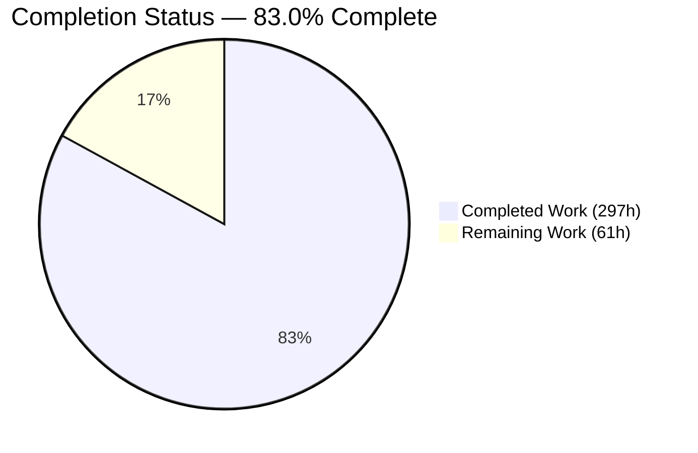
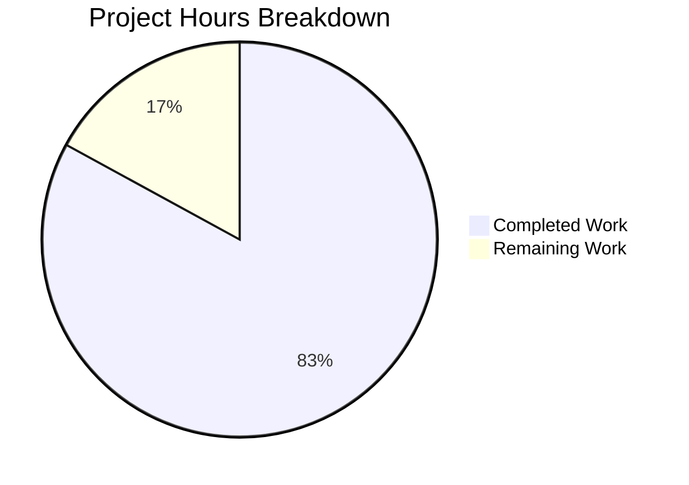
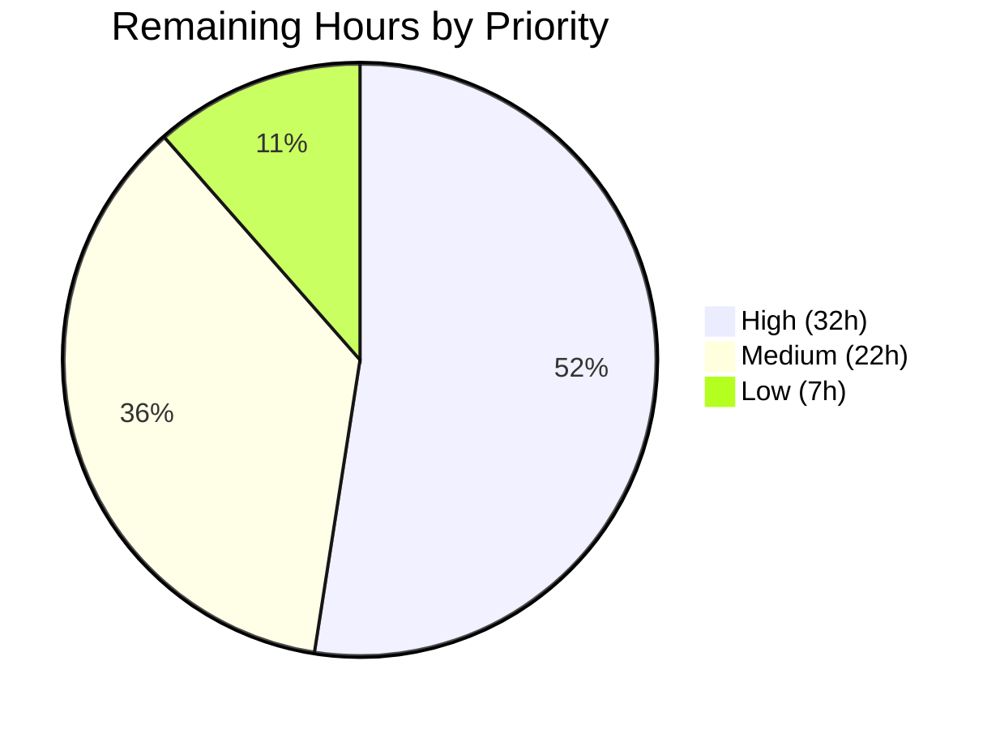

# 1. Executive Summary

## 1.1 Project Overview

This project adds a **ToDo Analytics Dashboard** to the Frappe Framework (`frappe` 17.0.0-dev). Any Desk user can open `/desk/dashboard-view/ToDo Analytics` and see how many ToDos are open and closed, how creation and completion volume trend day by day over a window they choose, and which users carry the most open ToDos. Built from the framework's own Desk primitives — two Number Cards, two Custom charts with server-side sources, one Dashboard record — it adds no dependency, schema change or role. The Desk chart, accessibility and request-authenticity surfaces underneath were hardened too.

## 1.2 Completion Status

**297 hours completed out of 358 total hours = 83.0% complete.**



Completed = Dark Blue `#5B39F3`; Remaining = White `#FFFFFF`.

| Metric | Value |
| --- | --- |
| Total Hours | 358 |
| Completed Hours (AI + Manual) | 297 (297 AI + 0 manual) |
| Remaining Hours | 61 |
| Percent Complete | 83.0% |

## 1.3 Key Accomplishments

- ✅ Permission-scoped open and closed ToDo count cards
- ✅ Daily created-vs-completed trend, window chosen by the viewer
- ✅ Deterministic top-five owners chart with per-bar values
- ✅ One Dashboard record bundling all four widgets, installed by `bench migrate`
- ✅ Axes, labels and tooltips share one number format, legible to 375 px
- ✅ Chart widgets and card tiles keyboard-operable, named, WCAG AA
- ✅ Cross-site token-less writes rejected; four security headers everywhere
- ✅ 262 targeted tests and 11 Cypress cases pass

## 1.4 Critical Unresolved Issues

All five deliverables the request named are delivered, rendered and verified: **0 of 5 unresolved**. **48 items remain open**, none in the dashboard's own code; the groups below carry exact counts and sum to 48. The shared framework files this branch changes also need maintainer sign-off (Section 5.2).

| Issue | Impact | Owner | ETA |
| --- | --- | --- | --- |
| Framework chart caching and telemetry (5 items) — chart data is never cached, and the per-read `last_synced_on` write makes ~20 concurrent chart refreshes return HTTP 508 | Every dashboard view recomputes both aggregations; a refresh storm shows viewers the widget error state | Platform / Backend | 1.5 days |
| Desk accessibility and presentation residuals on shared surfaces (8 items) — global mandatory-error input border, active dropdown item, dark-theme chart value labels, shortcut-tile focus ring, chart-header tab order, card naming for Report and Custom cards | Below-target contrast and interaction cues on Desk surfaces outside this dashboard; the dashboard's own surfaces meet AA | Frontend / Platform | 1 day |
| Screen-reader confirmation of announced states (7 items) — alert, live-region, selected-option, tile-name and focus announcements | Markup and roles are in place and were driven with a pointer and a keyboard; what a screen reader says is unconfirmed | QA / Accessibility | 0.5 day |
| Pre-existing framework and harness defects recorded and left as found (9 items) — heatmap chart data error, request-`None` idiom in the website router, Escape not dismissing a filter popover, date-range index before its length guard, `/files/*` responses carrying none of the four headers, `ui/` lockfile mismatch, unprefixed shared asset-map cache key, read-only-mode test config leak, a test module leaving two dead asset URLs in the cached hook list | Each pre-dates this work and none affects the dashboard; the last two make a local Desk look broken during test runs | Platform | 1 day |
| Retained security posture decisions (3 items) — `allow_cors: "*"` still reflects arbitrary origins with credentials, enumerated origins remain a trust boundary for token-less sessions, custom realtime handlers must send the token | Accepted and documented rather than closed; a compromised trusted origin can still drive writes | Security | 0.5 day |
| Capabilities delivered but not exercised by any test or runtime check (13 items, listed in Section 3) — heatmap widget paths, library-failure re-creation, widget delete, concurrency, caching, PostgreSQL, background services and six narrower branches | No standing signal if a future change breaks them | QA | 1.5 days |
| Dependency advisories (1 item, 36 advisories across the pinned tree) keep CI's Vulnerable Dependency Check red | The gate fails on every pull request from this tree; the advisories pre-date this work and no dependency was changed | Platform | 1.5 days |
| Project governance (2 items) — decision rows for the original delivery's post-plan decisions, and the test-inventory and traceability reconciliation | The record of *why* is complete for the hardening decisions and incomplete for the first delivery's; the enumerated inventory understates the delivered suite | Tech lead | 0.5 day |

## 1.5 Access Issues

No access issues identified. Every command in Section 9 ran against a live site and the dashboard was driven in a real browser. Two limits shape local observation rather than access: no background-job worker, SMTP capture or realtime process ran, and CI's PostgreSQL leg needs a label.

## 1.6 Recommended Next Steps

1. **[High]** Review the shared framework files as a framework change and release-note the two behaviour changes a site will notice (HTTP 417 on standard card writes, HTTP 400 on cross-site token-less writes).
2. **[High]** Decide the dependency advisory posture — bumps or documented waivers.
3. **[High]** Add a user-scoped chart-data cache key and coalesce the `last_synced_on` write, removing the HTTP 508.
4. **[High]** Open the pull request with its documentation link, PostgreSQL label and remaining CI gates.
5. **[Medium]** Run the screen-reader pass and close the residual contrast items.

# 2. Project Hours Breakdown

## 2.1 Completed Work Detail

| Component | Hours | Description |
| --- | --- | --- |
| Open / Closed Number Cards | 3 | Two standard Number Card records (`frappe/desk/number_card/todo_total_open/`, `todo_total_closed/`) with `function` Count and a single `status` predicate; permission-scoped counts through the shipped card engine |
| Created-vs-Completed chart source | 18 | Whitelisted `get` plus window resolution, day bucketing, zero-fill and two aggregations (`frappe/desk/dashboard_chart_source/todo_created_vs_completed/todo_created_vs_completed.py`, 307 lines) |
| Top Owners chart source | 13 | Whitelisted `get`, ranked limit-5 query with deterministic tie-break, bulk full-name resolution and plain-text labels (`frappe/desk/dashboard_chart_source/todo_top_owners/todo_top_owners.py`, 180 lines) |
| Chart and chart-source records, client configs, package markers | 6 | Two Dashboard Chart records (Custom Line, Custom Bar), two Dashboard Chart Source records, two `.js` configs registering the source methods, three `__init__.py` markers |
| Dashboard record and Desk reachability | 3 | `frappe/desk/desk_dashboard/todo_analytics/todo_analytics.json` binding two cards and two full-width charts; renders at `/desk/dashboard-view/ToDo Analytics` from Build → Dashboard |
| Trend chart source tests | 13 | 17 tests: daily bucketing of both series, zero-fill, reopen semantics, inclusive window boundary, empty state, Select-Date-Range and chart-payload paths, Monthly labels, permission scope |
| Top Owners tests | 10 | 14 tests: ranking and counts, id-ascending tie-break, fewer-than-five owners, exclusion of Closed/Cancelled/unallocated, empty → No Data, label markup stripping, single-query name lookup |
| Cross-cutting dashboard tests | 8 | 9 tests: card counts against seeded ToDos, empty-state zeros, presence and standard flags of all seven records, all four components loading, Desk-user visibility, client-config export parity |
| Cypress dashboard rendering spec | 5 | `cypress/integration/todo_analytics_dashboard.js` — seeds ToDos, visits the dashboard, asserts two card tiles, two chart widgets each with one `svg.frappe-chart`, the axis zero tick and the hidden error container |
| Standard-record write guard and chart-source config authorisation | 11 | Standard Number Cards reject writes without `developer_mode`; chart-source client configs are served only to authorised callers (`frappe/desk/doctype/number_card/number_card.py`, `.../dashboard_chart_source/dashboard_chart_source.py`) with 10 tests |
| Request-authenticity check for token-less cookie sessions | 20 | Same-site/Origin/Referer/`Sec-Fetch-Site` evaluation in `frappe/auth.py` with tests across `frappe/tests/test_auth.py` and `test_api.py` |
| Desk widget tooltips, focus and ARIA roles | 18 | Plot-area tooltips, focus restoration, keyboard-operable widget menus, ARIA roles, zero-tick formatting and the full-width chart grid (`chart_widget.js`, `dashboard_utils.js`, `number_card_widget.js`, `utils.js`, `desktop.scss`) |
| Delivery and migration verification | 6 | `bench migrate` re-import and idempotency, fresh-site install, record values confirmed in the database, exporter round-trip parity |
| Verification of the feature surfaces | 26 | Repository-wide and targeted suite runs, coverage measurement, Cypress execution, HTTP-level probes of every endpoint, browser-driven verification of the rendered dashboard, `pre-commit`, `compileall` and static analysis |
| PostgreSQL verification leg | 4 | Both aggregations and the card query exercised against PostgreSQL to confirm alias ordering and grouped-field semantics hold on both backends |
| Session CSRF token and fail-closed enforcement | 12 | Token minted with the session and returned by `POST /api/method/login`, fail-closed rejection for token-less cookie sessions, `allow_cors: "*"` no longer exempting CSRF, and the shipped Python client and Cypress harness sending `X-Frappe-CSRF-Token` (`frappe/sessions.py`, `frappe/auth.py`, `frappe/frappeclient.py`, `cypress/support/commands.js`) |
| Security response-header baseline | 10 | `X-Frame-Options`, a Desk-tuned `Content-Security-Policy`, `X-Content-Type-Options` and `Referrer-Policy` applied in `frappe/app.py::set_security_headers` with per-site overrides and renderer precedence, covered by `frappe/tests/test_security_headers.py` (56 tests) |
| Chart axis, tooltip and value-label formatting | 12 | Shared `frappe.utils.format_chart_axis_number` (site group separator, no floating-point artefacts, one abbreviation threshold), width-aware axis label density with debounced resize, and axis-identical tooltip and over-bar values |
| Chart widget interaction lifecycle | 14 | One fetch and redraw per time-window selection, per-instance chart document and settings, stale-response sequencing, a keyboard-operable Retry that re-reads the record, and a single date-range control with a full lifecycle |
| Keyboard operability and ARIA | 16 | Widget menus operable with the selected option marked and focus restored, named time-window toggles, focusable chart plot areas with a per-widget live region, Number Card tiles as named links, and shortcut-tile activation |
| WCAG AA contrast on Desk dashboard surfaces | 8 | Scoped token overrides in `frappe/public/scss/desk/desktop.scss` raising focus ring, placeholder, error text and breadcrumb contrast in both themes with no global token leakage |
| Responsive layout and tooltip containment | 6 | Full-width charts spanning every generated column, a header control row that fits 375 px, and chart tooltips wrapped inside their container |
| Dashboard filter-state correctness | 5 | Dynamic filters that resolve to nothing are omitted from the widget filter state while `0` and `false` are preserved (`frappe/public/js/frappe/utils/dashboard_utils.js`) |
| Cypress coverage expansion | 12 | `cypress/integration/todo_analytics_dashboard.js` grown to 11 cases covering axis formatting, time-window re-render and focus, error retry, menu keyboard operation, keyboard tooltips, contrast, tile affordance, empty filters, response headers and narrow-viewport tooltips |
| Test-harness isolation and hygiene | 6 | Repeatable `test_auth` runs against the login rate limiter, a Cypress workflow leftover no longer aborting later modules, and the notification path that made it fatal (`frappe/tests/ui_test_helpers.py`, `frappe/workflow/doctype/workflow_action/workflow_action.py`) |
| Explainability record | 10 | A 141-row decision log with alternatives, reasoning and risks per row, plus the reviewable change description carrying the behaviour notes, the file disclosure, the manual-check list and the CORS audit (`blitzy/documentation/PR Description.md`) |
| Verification of the Desk and security surfaces | 22 | Runtime verification at four viewports in both themes, measured contrast and accessibility-tree checks, 11-case Cypress runs, targeted module suites, static gates and a repository-wide run with coverage |
| **Total** | **297** | |

## 2.2 Remaining Work Detail

| Category | Hours | Priority |
| --- | --- | --- |
| Review and sign off the shared framework files as a framework change, with release notes | 6 | High |
| Dependency advisory posture: 36 advisories closed by coordinated bumps or documented waivers | 12 | High |
| Chart data caching and telemetry, including the concurrent-refresh HTTP 508 | 10 | High |
| Pull-request completion and CI gates (documentation link, semantic commit, Semgrep, PostgreSQL label) | 4 | High |
| Residual contrast items on shared Desk surfaces (global mandatory-error border, active dropdown item, dark-theme chart value labels, shortcut-tile ring) | 5 | Medium |
| Screen-reader confirmation pass over the announced alert, live-region, selected-option and tile-name states | 4 | Medium |
| Repository-wide suite run in a CI-shaped environment (background workers, SMTP capture, realtime process) | 6 | Medium |
| Concurrency load test of a dashboard at roughly twenty simultaneous viewers | 3 | Medium |
| Decision rows for the original delivery's post-plan decisions | 2 | Medium |
| Reconcile the enumerated test inventory and traceability map with the delivered suite | 2 | Medium |
| Dashboard list and form responsive clipping below 768 px | 4 | Low |
| Automated coverage for the heatmap chart widget paths (year filter, error state) | 3 | Low |
| **Total** | **61** | |

## 2.3 Hours Methodology

Total project hours are the sum of the estimates for every deliverable named in the plan, the hardening the project owner subsequently directed on the Desk and security surfaces this dashboard depends on, and the path-to-production activities needed to deploy them; nothing outside that scope is counted. Completed hours are the delivered items at full weight plus the completed fraction of the three partially delivered items (the CI-gate set ≈60%, the additivity contract ≈50%, the explainability record ≈80%). Remaining hours are the outstanding fractions of those three items plus the path-to-production gaps listed in Section 2.2.

```
Completed = 297h
Remaining =  61h
Total     = 297 + 61 = 358h
Complete  = 297 / 358 = 83.0%
```

Confidence: **High** for the delivered feature and hardening work and its verification, which rest on executed tests and observed runtime behaviour; **Medium** for the dependency-advisory and residual-accessibility rows, whose scope depends on decisions the owning team has yet to make.

# 3. Test Results

Every figure below was produced by running the suite against a migrated `test_site` on this branch; the repository-wide row is a single full-suite pass with coverage, and the rows above it are the targeted runs for each capability.

| Area / Category | Framework | Tests | Passed | Failed | Coverage | What This Proves |
| --- | --- | --- | --- | --- | --- | --- |
| Created-vs-Completed trend source | Frappe `IntegrationTestCase` | 17 | 17 | 0 | 97.8% (module) | Both series bucket by day, zero-fill quiet days, honour the inclusive window edge and never double-count a reopened ToDo |
| Top Owners source | Frappe `IntegrationTestCase` | 14 | 14 | 0 | 100% (module) | The top-five ranking is deterministic under ties, excludes Closed, Cancelled and unallocated rows, and renders labels as safe plain text |
| Dashboard records, cards and visibility | Frappe `IntegrationTestCase` | 9 | 9 | 0 | — | All seven records install as standard Desk records, both cards count the right statuses, all four widgets load, and a plain Desk user can see them |
| Dashboard framework primitives | Frappe `IntegrationTestCase` | 30 | 30 | 0 | `number_card.py` 58.9% | The shipped chart, chart-source, card, dashboard and ToDo engines this feature configures behave as specified, including the standard-record write guard and config authorisation |
| Session, request authenticity and REST surface | Frappe unit + `IntegrationTestCase` | 121 | 121 | 0 | `auth.py` 89.7%, `sessions.py` 87.2% | A session carries a CSRF token from creation and the login response exposes it; cross-origin, cross-site, foreign-Referer and null-Origin writes on a token-less cookie session are rejected, while same-origin, non-browser and Guest-login requests still succeed |
| Security response headers and CORS | Frappe `IntegrationTestCase` | 60 | 60 | 0 | `app.py` 72.1% | Every dynamic response carries the four headers, a site can override each of them, renderer-set headers keep precedence, and a wildcard-CORS site still receives the baseline |
| Desk UI end-to-end | Cypress 13 / Chrome | 11 | 11 | 0 | — | The dashboard renders two tiles and two charts; axis ticks stay legible and consistently formatted; each time-window change re-renders and keeps focus; a failed chart recovers through Retry; menus and plot areas are keyboard-operable; contrast, tile affordance, empty filters, response headers and a long label at 375 px all hold |
| Repository-wide regression | Frappe test runner | 2,570 | 2,433 | 66 | 73.1% overall | The framework as a whole is unchanged outside the services this environment does not provide; no incomplete result sits in a file this branch touches |

Module coverage for the surfaces this project changed: `todo_top_owners.py` 100%, `todo_created_vs_completed.py` 97.8%, `frappe/auth.py` 89.7%, `frappe/sessions.py` 87.2%, `frappe/app.py` 72.1%, `dashboard_chart_source.py` 76.1%, `number_card.py` 58.9%; repository-wide line coverage 73.1% (55,685 of 76,133 lines). The full-suite pass also skipped 71 tests by design. Its 66 incomplete results all sit in areas that need a background job worker, an SMTP capture service, a realtime process or the `bench` CLI, none of which was running — the query recorder, background jobs and queue workers, outbound email, user invitations, prepared reports and the CLI command tests. Every one was attributed, and none is in a file this branch changes.

**Not Covered — test before release**

- **Heatmap chart paths.** The heatmap year filter and the heatmap error state share the widget code the other charts exercise, but no heatmap record exists in this repository, so neither branch runs. Create one and drive both before relying on heatmaps.
- **Library-failure recovery and widget teardown.** Chart re-creation after a rendering-library failure, and the per-widget teardown that removes a date-range control, were observed only under an injected failure and through navigation; no test forces either.
- **Screen-reader announcements.** The alert, live-region, selected-option and tile-name markup is asserted in the Cypress spec, but what a screen reader says is not. Verify with NVDA or VoiceOver.
- **Concurrency.** No test drives concurrent chart refreshes, which is the condition under which the framework's per-read chart bookkeeping returns HTTP 508. Load-test a dashboard with roughly twenty simultaneous viewers.
- **Caching.** Both chart sources compute on every non-refresh request rather than serve the framework's shared chart-data key, so there is no cache population or expiry to assert and no test asserts any.
- **PostgreSQL.** Both aggregations and the card query were exercised against PostgreSQL by hand; CI runs that leg only when a pull request is labelled for it, so there is no standing automated signal.
- **Background services.** Queued jobs, outbound email and realtime updates were not exercised. This feature uses none of them, but a CI-shaped run is the only way to confirm that from a green board.
- **Narrower branches.** Six defensive paths have no automated coverage: a site number format without a decimal separator, stacked-bar value labels, Number Card tiles on Workspace pages, card naming for Report and Custom cards, the client's token fallback against an older server, and Space-key activation of Retry (Enter is covered).

# 4. Runtime Validation & UI Verification

The dashboard was driven in a real browser against a migrated site with seeded ToDos, and every server method behind it was called over HTTP.

- ✅ **Page load** — `/desk/dashboard-view/ToDo Analytics` renders with `document.title` "ToDo Analytics Dashboard" and breadcrumb "Dashboard / ToDo Analytics"; both chart SVGs are present on the first check, and every dashboard API call — permitted cards and charts, the four record loads, both card results, both client configs and both chart sources — returned HTTP 200 on two consecutive loads.
- ✅ **Number card tiles** — two tiles titled "ToDo Total Open" and "ToDo Total Closed" render their counts (102 and 6 against the live data), with no percentage badge, matching the configured records.
- ✅ **Trend chart** — one chart SVG with eight daily x-ticks (`09-15-2026` … `09-22-2026`), a `Created` / `Completed` legend and both series plotted; y ticks read `0, 50, 100, 150, 200` with the lowest tick `0` and no separator or decimal noise.
- ✅ **Top Owners chart** — five ranked bars with the open count printed over every bar (`3, 3, 2, 1, 1`) in descending order; bar heights track the values exactly.
- ✅ **Chart tooltips** — hovering the plot area shows the tooltip for the bar under the pointer ("Administrator", value `3`, label "Open ToDos"), its value formatted by the same function as the axis, and `aria-hidden` removed while it is visible; at 375 px a 112-character owner name stays inside the widget with no horizontal page overflow.
- ✅ **Time-window controls** — the trend widget exposes both dropdowns, named in the accessibility tree as "Time window: Last Week" and "Time interval: Daily"; each selection issues one request with the selected arguments, redraws, and returns focus to the control used; the ranked chart correctly shows neither, being a non-timeseries chart.
- ✅ **Keyboard operation** — widget menus open, mark the applied option and restore focus on close; the plot area takes focus and Arrow, Home, End, Enter and Escape move and dismiss the tooltip with the value announced through the widget's live region; Number Card tiles are focusable named links that activate from the keyboard.
- ✅ **Error state and recovery** — the error container stays hidden throughout normal operation (present in the DOM, `display: none`, zero-area); with a forced server error it shows an alert and a Retry control that re-reads the chart record, re-fetches and clears the error.
- ✅ **Request authenticity and headers** — `POST /api/method/login` returns a `csrf_token`; a cross-site `POST /api/resource/ToDo` carrying only a session cookie is rejected with `400 CSRFTokenError`, while the same request same-origin, from a non-browser client, or as a Guest login succeeds; every response carries `X-Frame-Options: SAMEORIGIN`, a CSP with `frame-ancestors 'self'` and `object-src 'none'`, `X-Content-Type-Options: nosniff` and `Referrer-Policy: strict-origin-when-cross-origin`.
- ⚠ **Concurrency** — under roughly twenty simultaneous chart refreshes the framework's per-read chart bookkeeping returns HTTP 508 and viewers see the widget's error state; this was reproduced by probe, not by an automated load test.

**Never exercised at runtime:** what a screen reader announces for the alert, live region, selected option and tile names — the markup and roles are in place and the paths were driven with a pointer and a keyboard; the heatmap chart variant, for which no record exists; and queued jobs, outbound email and realtime push, which this feature does not use and which were not running. The `/socket.io` 404s seen under a single-process dev server are that absence, not a fault in the page.

# 5. Compliance & Quality Review

## 5.1 Compliance Matrix

| Deliverable / Benchmark | Status | Verified State |
| --- | --- | --- |
| Open and Closed Number Cards | ✅ Pass | Both records install standard in module Desk with a single `status` predicate; counts verified against seeded data, through the shipped card engine and on the rendered page |
| Created-vs-Completed trend chart (source, record, client config) | ✅ Pass | Two datasets over a zero-filled daily window; 17 tests, 97.8% module coverage; eight buckets and both series read back in the browser |
| Top Owners ranked chart (source, record, client config) | ✅ Pass | Deterministic limit-5 ranking with plain-text labels; 14 tests, 100% module coverage; five bars with a value printed over each |
| ToDo Analytics Dashboard record and Desk route | ✅ Pass | Two cards and two full-width charts render at `/desk/dashboard-view/ToDo Analytics`, reachable from Build → Dashboard |
| Standard-record delivery by folder sync | ✅ Pass | `bench migrate` and fresh-site install import all seven records idempotently; aggregations confirmed on MariaDB and PostgreSQL |
| Server contract: permission scoping and type-annotated API | ✅ Pass | All four aggregations run through `frappe.get_list`, so ToDo's permission conditions apply, asserted by test and by re-querying as a restricted user; both `get` methods annotate every parameter as `require_type_annotated_api_methods` (`frappe/hooks.py:159`) demands |
| Desk chart presentation, formatting and keyboard operability | ✅ Pass | Axis ticks, over-bar values and tooltips share one formatter with the site group separator and no floating-point artefacts; label density adapts to widget width down to 375 px; menus, time-window toggles, plot areas and tiles are focusable, named and operable with the applied option marked and focus restored |
| WCAG AA contrast on dashboard surfaces | ⚠ Partial | Focus ring, placeholder, error text and breadcrumbs measured at or above AA in both themes with no global token leakage; contrast items on shared Desk surfaces outside this dashboard remain below target |
| Request authenticity and response headers | ✅ Pass | A session carries a CSRF token from creation and login exposes it; cross-site writes on token-less sessions are rejected; four security headers on every dynamic response, overridable per site; 181 tests |
| Automated test suite and coverage | ✅ Pass | 262 targeted tests and 11 Cypress cases pass; both chart sources at or near full module coverage; repository-wide coverage 73.1% |
| Static analysis, formatting and dependency gates | ⚠ Partial | `pre-commit` (ruff, prettier, eslint, check-json), `compileall` and Semgrep all clean; the dependency audit fails on 36 advisories that pre-date this work |
| Plan-governance compliance (additivity contract, explainability record) | ⚠ Partial | No rationale sits in code comments and every hardening decision is recorded in a 141-row decision log; the shared framework files changed against a zero-edit contract, and the first delivery's decision rows and the test inventory are not yet reconciled |

## 5.2 AAP & Rule Divergences and Gaps

| What the AAP/Rule Required | What Was Delivered Instead | Why It Diverged | Impact | Remediation |
| --- | --- | --- | --- | --- |
| §0.7.1 and D15: zero edits to existing files; §0.9.2: no change under `frappe/public/js/`; §0.5: no front-end markup or styling of the feature's own | 29 existing framework paths modified and 1 test module added — `frappe/auth.py`, `sessions.py`, `app.py`, `frappeclient.py`, four `frappe/public/js/` files plus `dialog.js`, `filter_list.js`, `shortcut_widget.js`, `desktop.scss`, `dashboard_settings.py`, `number_card.py`, `dashboard_chart_source.py`, `file.js`, `workflow_action.py`, `ui_test_helpers.py`, seven test modules and two Cypress files | **Sanctioned.** A later instruction from the project owner required the dashboard's shared surfaces to be fixed rather than shipped as they behaved: token-less cookie sessions accepted cross-site writes, no security headers were emitted, chart controls were neither keyboard-operable nor legibly formatted, and Desk contrast failed AA. The same instruction required the files to be disclosed rather than avoided | Behaviour changes for every Frappe app and site on this branch, not just this dashboard | Review as a framework change; release-note the two user-visible behaviour changes (HTTP 417 on standard card writes, HTTP 400 on cross-site token-less writes) |
| Rule 1: every non-trivial decision recorded in a Markdown decision-log table with alternatives, reason and risks, and no rationale in code comments | Satisfied for the hardening work — 141 rows with all four columns filled, and every comment that carried reasoning rewritten to state what the code does and name its row. Not satisfied for the first delivery's post-plan decisions, which remain unlogged | The plan's own decision log is external and frozen, so the rows were written into the repository's change description instead; reconciling the earlier decisions was deferred by the same instruction | The record of *why* is complete for the hardening work and incomplete for roughly a dozen decisions in the original chart-source and record code | Add one renumbered set of rows for the first delivery's decisions (2 hours, Section 2.2) |
| §0.4.3 / §0.6.2: one whitelisted `get` plus two named private helpers per source, `@frappe.whitelist()` over `@cache_source` | Both modules carry additional private helpers and constants; the cache decorator wraps a private function and the shared chart-data key is deliberately never served; the whitelist is restricted to GET and POST | Argument validation, window guards and a period ceiling were needed, and the shared cache key has no user component, so serving it would show one user another user's counts | Correct and safe, but the module shape differs from the plan and nothing is cached | Accept, or add a user-scoped cache key (costed in Section 2.2) |
| §0.6.2 and D18: label owners with `frappe.get_cached_value("User", user, "full_name")` | One bulk name lookup for all five owners, with markup stripped from the looked-up name | Five cached reads became one query, and a full name containing markup would otherwise reach the chart label | Positive: fewer queries, no markup in labels. A name containing `<` renders with that fragment removed | None required; record the decision |
| §0.6.1: each client config declares `filters: []` | Both configs declare `filters: null` | An empty array is truthy in JavaScript, so the widget treated it as "filters exist" and offered a dialog with no fields in it | Better behaviour than specified; the dialog now states that no filters are set | None required; record the decision |
| §0.6.1 and `.editorconfig`: record JSON with one-space indent and no final newline, limited to the listed keys | All seven record files end with a newline and the two chart records carry `color` and `last_synced_on` | The framework's own exporter writes them that way, so this is what a round-trip through Desk produces | None functionally; the files match the exporter and the shipped records rather than the written convention | Accept, or align the convention |
| §0.8.2 / §0.8.5: 22 Python test methods and 23 cases in total, with a single-case Cypress spec | 40 feature test methods, 11 Cypress cases and 211 further tests across framework modules; three Top Owners tests renamed; two fail-open request-authenticity tests renamed with flipped expectations | **Sanctioned.** Covering the delivered code and the directed hardening required more cases, and the flipped tests encode the fail-closed behaviour the project owner asked for | The enumerated inventory understates the suite, so traceability by test name no longer resolves | Reconcile the inventory and traceability map with the delivered suite (2 hours, Section 2.2) |
| §0.8.4: all CI gates pass, including the Vulnerable Dependency Check, with the PostgreSQL leg in the matrix | The dependency audit reports 36 advisories; the PostgreSQL leg was exercised by hand | No dependency was added, changed or removed — the advisories are in the pinned tree already; CI runs the PostgreSQL leg only behind a pull-request label | One CI gate is red on every pull request from this tree; PostgreSQL has no standing automated signal | Decide bumps or waivers; label the pull request for the PostgreSQL leg |

**Zero-edit contract.** The plan's expected outcome was no edits to existing files, and the feature itself honours that: all eighteen new artefacts are additive. Twenty-nine existing framework paths nevertheless changed, because a later instruction from the project owner required the dashboard's neighbourhood to be fixed as well: request authenticity, response headers, chart formatting, control lifecycle, error recovery, keyboard and ARIA behaviour, Desk contrast and filter-state correctness. Each path is disclosed with the instruction that required it in `blitzy/documentation/PR Description.md` §3, and the branch diff is +13,064 / −390 across 49 files. A maintainer must decide whether those paths belong in this change or in a separate framework pull request; two of them alter behaviour a site will notice.

**Explainability record.** Rule 1 requires a Markdown table of decision, alternatives, reason and risks for every non-trivial decision, and forbids rationale in code comments. Both halves hold for the hardening work: `blitzy/documentation/PR Description.md` §6 carries 141 rows, each with all four columns filled, and every comment that had carried reasoning — across eleven files including `frappe/auth.py`, `chart_widget.js` and `desktop.scss` — states only what the code does and names the row holding the why. Missing are the first delivery's post-plan decisions: the cache placement, the bulk label lookup, the null filter declaration, the whitelist narrowing and the validation guards, which exist as reasoning in the rows above rather than in the project's own log. Closing that is two hours.

**Chart-source module shape.** Both sources deliver the specified contract — the same parameter list as the shipped chart method, every parameter annotated, the documented return shapes — and add what the plan did not anticipate: argument validation, window sanity guards, a maximum period count, and a cache decorator moved onto a private function so that the framework's shared `chart-data:<name>` key is never served. That last point is deliberate and load-bearing: the key carries no user component, and these aggregations are permission-scoped, so a shared entry would show one user another user's counts. The cost is that every dashboard view recomputes both aggregations (`frappe/desk/dashboard_chart_source/todo_created_vs_completed/todo_created_vs_completed.py`). Section 2.2 carries the user-scoped cache key as remaining work.

**Owner labels.** The plan specified a per-user `frappe.get_cached_value` for each of the five names; the delivered source resolves all five in one bulk lookup and strips markup from the result before it becomes a chart label. Both changes are improvements — one query instead of five, and no markup fragment reaching the rendered label — and both are covered by tests, including one that asserts a single user query for the whole ranking. The behavioural consequence a reader should know: a full name containing angle brackets renders with that fragment removed, so `A < B > C` appears as `A  C`. No action is needed beyond recording the decision.

**Client filter declaration.** The plan specified `filters: []` in each client config; both are delivered as `filters: null` (`frappe/desk/dashboard_chart_source/todo_top_owners/todo_top_owners.js`), because an empty array is truthy in JavaScript and the widget read it as "filters exist", then opened a dialog containing no fields. With `null` the widget reports that no filters are set, which is what a viewer of these charts should see — neither chart takes filters. The change is pinned by a test that asserts the served configuration and by an exporter round-trip parity test. No human action is required; this row exists so the difference from the written specification is not a surprise.

**Record file formatting.** The plan and `.editorconfig` call for one-space-indented JSON with no final newline and a fixed key set. All seven record files end with a newline, and the two chart records carry `color` and `last_synced_on`. This is exactly what the framework's own exporter produces when a standard record is saved in developer mode, and it matches the shipped Desk records, so the files are byte-compatible with a Desk round-trip rather than with the written convention. Nothing breaks: the importer compares `modified` timestamps and re-imported both charts cleanly on every migration. Either accept the exporter's output as the convention or adjust the convention to match it.

**Test inventory drift.** The plan enumerated 22 Python methods and 23 cases; the delivered suite has 40 feature methods, 11 Cypress cases and 211 further tests across framework modules, three of the Top Owners tests carry different names, and two request-authenticity tests were renamed with their expectations flipped to encode the fail-closed behaviour the project owner directed. The suite is larger and stronger than planned, so this is drift in the record rather than in the code. The practical impact is that traceability by test name no longer resolves, so anyone auditing requirement-to-test coverage must read the modules. Reconciling the inventory and the traceability map is two hours of work.

**CI gate status.** The dependency audit reports 36 advisories across `pypdf`, `cryptography` and `sqlparse`. No dependency was added, removed or changed by this work — the manifests are byte-identical to the base — so these are pre-existing pins surfacing in a gate that was already red. They still matter, because the gate fails on every pull request from this tree, and the bumps are coupled (`cryptography`↔`pyOpenSSL`, `sqlparse`↔`sql_metadata`) alongside a CI assertion that `yarn.lock` is unchanged. Separately, both aggregations and the card query were exercised against PostgreSQL by hand; CI runs that leg only when the pull request is labelled for it, so label it before merge.

# 6. Risk Assessment

These are forward-looking: what can still go wrong once this dashboard is in front of users.

| Risk | Category | Severity | Probability | Mitigation | Status |
| --- | --- | --- | --- | --- | --- |
| Concurrent chart refreshes return HTTP 508 — the framework writes `last_synced_on` to `tabDashboard Chart` on every read, and roughly twenty simultaneous refreshes deadlock on that row, showing viewers the widget error state | Technical / Operational | High | Medium | Coalesce or defer the bookkeeping write, or make it fire-and-forget; reproduces on the shipped charts too, so a framework-level fix covers all dashboards | Open — 10h in Section 2.2 |
| Chart data is recomputed on every view; the shared cache key is bypassed by design because it carries no user component, and the ToDo `status`, `allocated_to` and `modified` columns are unindexed (~0.67 ms per 1,000 rows scanned) | Technical / Performance | Medium | Medium | Introduce a user-scoped cache key with a short TTL; add covering indexes if a site's ToDo table grows into the millions | Open — costed with the caching work |
| 36 dependency advisories in `pypdf`, `cryptography` and `sqlparse` keep the Vulnerable Dependency Check red on every pull request | Security | High | Certain | Coordinated bumps honouring the `cryptography`↔`pyOpenSSL` and `sqlparse`↔`sql_metadata` constraints, or documented per-advisory waivers | Open — 12h in Section 2.2 |
| Twenty-nine shared framework paths change behaviour for every app and site on this branch: standard Number Cards now reject writes without `developer_mode` (HTTP 417), cross-site token-less writes now fail with HTTP 400, every response carries four new headers, and Desk widget markup, roles and contrast tokens changed | Integration | Medium | Medium | 181 Python tests and 11 Cypress cases are the regression net; release-note both user-visible changes and review the diff as a framework change | Open — 6h sign-off in Section 2.2 |
| Third-party API clients that hold a cookie session and send neither a CSRF token nor a browser-origin header are rejected after upgrade | Integration / Security | Medium | Medium | The token is returned by `POST /api/method/login` and the shipped Python client sends it; the change is release-noted, and a site can allow specific referrers | Accepted — release note required |
| Sites configured with `allow_cors: "*"` still reflect arbitrary origins with credentials at the response layer, and enumerated origins remain a trust boundary for token-less sessions | Security | Medium | Low | Audit permissive CORS configuration per site; the wildcard no longer exempts a request from the authenticity check, and every retained case is documented | Open — audit recorded, no code change pending |
| Accessibility residuals on shared Desk surfaces — global mandatory-error input border, active dropdown item, dark-theme chart value labels, shortcut-tile focus ring — and announced states unconfirmed by a screen reader | Operational / Compliance | Medium | Medium | Raise the affected global tokens with their consumers checked, then run a screen-reader pass before any accessibility claim is made | Open — 9h in Section 2.2 |
| `/files/*` downloads carry none of the four response headers, so public uploads are the one surface the header baseline does not reach | Security | Medium | Low | Add the headers at the edge proxy for the file path, or extend the baseline to that renderer; uploaded HTML and SVG are already forced to download | Open — operator note required |

# 7. Visual Project Status

**Overall progress — 297 of 358 hours complete (83.0%).** Completed = Dark Blue `#5B39F3`; Remaining = White `#FFFFFF`.



**Remaining work by priority** (sums to 61 hours):



**Remaining hours by category** (Section 2.2, largest first):

| Category | Hours |
| --- | --- |
| Dependency advisory posture | 12 |
| Chart caching and telemetry | 10 |
| Framework-file sign-off and release notes | 6 |
| CI-shaped repository-wide suite run | 6 |
| Residual contrast items on shared Desk surfaces | 5 |
| Pull-request completion and CI gates | 4 |
| Screen-reader confirmation pass | 4 |
| Dashboard list/form responsive clipping | 4 |
| Concurrency load test | 3 |
| Heatmap chart widget coverage | 3 |
| Decision rows for the first delivery's decisions | 2 |
| Test-inventory reconciliation | 2 |
| **Total** | **61** |

# 8. Summary & Recommendations

The ToDo Analytics Dashboard is delivered and working. All five things the request named exist as standard Desk records that install with the app: two Number Cards counting open and closed ToDos, one two-series Line chart showing created-versus-completed volume per day over a window the viewer can widen or narrow, one ranked Bar chart of the five users carrying the most open ToDos, and one Dashboard record that bundles them and renders at `/desk/dashboard-view/ToDo Analytics` from Build → Dashboard. The feature itself is purely additive — eighteen new files, no schema change, no new dependency, no new role, no patch or hook entry — and every aggregation is permission-scoped through `frappe.get_list`, so a user never sees a count over ToDos they cannot read.

The Desk surfaces the dashboard sits on were then hardened to the same standard, because a dashboard is only as good as the widgets, the session and the response headers underneath it. Chart axes, over-bar values and tooltips now share one number format; axis labels stay legible from 1400 px down to 375 px; every time-window change issues one request, redraws, and leaves the keyboard where the user put it; a failed chart offers Retry instead of a page reload; menus, plot areas and card tiles are keyboard-operable and named for assistive technology; Desk dashboard surfaces meet WCAG AA contrast; a session now carries a CSRF token from creation, cross-site writes on token-less sessions are refused, and every dynamic response carries four security headers a site can override.

Verification went beyond unit assertions. 262 targeted tests and 11 Cypress cases pass; module coverage is 100% for the ranking source, 97.8% for the trend source and 89.7% for the session and authenticity code; a repository-wide run executed 2,570 tests with 2,433 passing and 73.1% line coverage, every incomplete result attributable to a background worker, mail or CLI service this environment does not run and none of them in a file this branch changes. The page was driven in a real browser, where both cards, both charts, the legend, the eight daily buckets, the values over every bar, the tooltip, the named time-window toggles and the hidden error container were all observed, with every dashboard API call returning 200. Section 3 records exactly what no test covers — heatmap paths, library-failure recovery, screen-reader announcements, concurrency, caching, PostgreSQL and background services.

**Project status: 297 of 358 hours complete, 83.0%.** The 61 remaining hours are not feature work. They are the shared Frappe surfaces this dashboard sits on and the governance around the change. Four items sit on the critical path to production: maintainer sign-off on the twenty-nine existing framework paths this branch changes, two of which alter behaviour a site will notice; a decision on the 36 dependency advisories that keep CI's dependency gate red; chart data caching and telemetry, which also removes the HTTP 508 that roughly twenty simultaneous refreshes provoke; and completing the pull request with its documentation link and PostgreSQL label.

Production readiness: **ready for a staged release, not yet for an unqualified one.** The dashboard can go in front of users today on a site with modest concurrency, because everything the request asked for is verified working and nothing in the feature's own code is open. What holds back an unqualified release is not the dashboard but its neighbourhood: a red dependency gate, a chart-refresh path that degrades under concurrency, contrast items on Desk surfaces beyond this page, and announced states no screen reader has yet confirmed. Treat the shared framework files as a framework change with its own review and release note, then land the dashboard behind it. Success metrics to watch after release: dashboard widget calls returning HTTP 200 (currently all of them), chart-source response times under load, the rate of HTTP 508 responses on `tabDashboard Chart` reads (non-zero above ~20 concurrent refreshes today, target zero), and a green CI board once the dependency posture is decided.

# 9. Development Guide

Every command below was executed against this branch. Substitute your bench directory and site name; `test_site` is used throughout.

**System prerequisites** — versions this branch was built and verified against:

| Component | Version | Declared in |
| --- | --- | --- |
| Python | 3.14.7 | `pyproject.toml` (`requires-python >=3.14,<3.15`) |
| Node.js / npm | 24.21.0 / 11.19.0 | `package.json` (`engines.node >=24`) |
| Yarn | 1.22.22 | — |
| MariaDB | 11.8.3 | CI service definition |
| Redis | 8.0.2 | cache and queue |
| Chrome / Cypress | 153 / 13.17.0 | UI tests |
| wkhtmltopdf | 0.12.6.1 (patched qt) | PDF rendering |
| ruff / pre-commit | 0.14.10 / 4.6.2 | `.pre-commit-config.yaml` |

**Environment setup**

```bash
# From an empty directory; the standard Frappe workflow (see README.md)
bench init frappe-bench --frappe-path <this-repository> --frappe-branch <this-branch>
cd frappe-bench
bench new-site test_site --db-type mariadb --db-host 127.0.0.1
bench --site test_site set-config allow_tests 1 --parse
bench --site test_site set-config server_script_enabled 1 --parse
bench --site test_site set-config mute_emails 1 --parse
echo "127.0.0.1 test_site" | sudo tee -a /etc/hosts
```

Keep `developer_mode` at `0`. With it enabled, saving a standard record in Desk rewrites the repository JSON — useful when you intend to edit the dashboard records, disruptive when you do not. Keep the site's `host_name` equal to the host and port you actually browse (`bench --site test_site set-config host_name http://test_site:8000`): the request-authenticity check compares the request's origin against the site's hostnames, so browsing `127.0.0.1` while `host_name` names `test_site` can return `400 CSRFTokenError` on Desk writes.

If you run more than one bench on one host, give each bench its own Redis cache database before anything else:

```bash
bench set-config -g redis_cache redis://127.0.0.1:13000/11   # -g writes sites/common_site_config.json
```

The Desk asset map is cached under a key that names neither the site nor the bench, so two benches sharing one cache database overwrite each other's copy of it. The symptom is a Desk that never boots: HTTP 200 with a blank page, `TypeError: frappe.call is not a function`, and 404s for `desk`, `list`, `form` and `report` bundle URLs whose hashes appear nowhere in `sites/assets/assets.json`. Where the configuration cannot change, `redis-cli -p 13000 -n 0 del assets_json` and restart that bench's web process. The accompanying "strict MIME type checking" console message is `X-Content-Type-Options: nosniff` applied to the 404 page, not a policy refusal.

**Dependency installation and asset build**

```bash
cd apps/frappe
yarn install --frozen-lockfile     # must leave yarn.lock byte-identical; CI asserts this
cd ../..
bench build --app frappe           # observed: "Total Build Time: 3.857s"
```

`bench build --app frappe` is not optional. Tests and pages that render HTML read the asset manifest; without a build they fail with `AttributeError: 'NoneType' object has no attribute 'get'` from `frappe/utils/jinja_globals.py`. Rebuild after changing any `.bundle.js` or `.scss` — the served bundle is build output, so a stylesheet change that is in `frappe/public/scss/desk/desktop.scss` has no effect in the browser until you rebuild and restart the web process. To confirm a rule reached the served CSS:

```bash
grep -o '"desk.bundle.css": "[^"]*"' sites/assets/assets.json
grep -c 'graph-svg-tip{[^}]*overflow-wrap' sites/assets/frappe/dist/css/desk.bundle.<HASH>.css
```

**Install the dashboard records**

```bash
bench --site test_site migrate
```

Expected output includes `Syncing dashboards...` followed by `Updating Dashboard for frappe`. This imports the two Number Cards, the two Dashboard Charts, the two Dashboard Chart Sources and the Dashboard record. It is idempotent — re-running re-imports only records whose file timestamp is newer than the stored row.

**Start the application**

```bash
CI=true bench start                                     # full process group: web, socketio, workers, watcher
# or, for a single web process on a chosen port:
CI=true bench --site test_site serve --port 8400
```

`CI=true` matters on the web process, not only on the `bench execute` that creates the UI test user: every endpoint in `frappe/tests/ui_test_helpers.py` is gated on test mode, a development server, or `CI` being present, and a bare `serve` sets neither of the first two. Without it, 25 of the Cypress specs fail in their `before` hook with HTTP 417 "Test endpoints are only available when running in test mode or running a development server".

**Verification**

```bash
curl -s http://127.0.0.1:8400/api/method/ping          # -> {"message":"pong"}
curl -sI http://test_site:8400/api/method/ping         # -> X-Frame-Options, CSP, nosniff, Referrer-Policy
python -m compileall -q -f frappe                      # -> exit 0, no output
```

Open `http://test_site:8400/desk` and sign in as `Administrator`. The dashboard is at `http://test_site:8400/desk/dashboard-view/ToDo Analytics`, reachable through Build (`/desk/build`) → Dashboard → ToDo Analytics → Show Dashboard. `/app/...` is a 301 alias for `/desk/...`.

What a correct page looks like: two card tiles titled "ToDo Total Open" and "ToDo Total Closed"; a Line chart with eight daily x-ticks, a `Created` / `Completed` legend and a lowest y tick of `0`; a Bar chart with up to five bars labelled with user full names and the count printed over each bar; timespan and interval dropdowns on the Line chart only, named "Time window: Last Week" and "Time interval: Daily" for assistive technology; no visible error banner. With no open allocated ToDo, the Bar chart shows "No Data" — that is correct, not a failure.

Confirm the records landed:

```bash
bench --site test_site console
```

```python
frappe.db.get_value("Dashboard", "ToDo Analytics", ["name", "module", "is_standard"])
frappe.db.get_all("Dashboard Chart", filters={"source": ["like", "ToDo%"]}, fields=["name", "chart_type", "type"])
frappe.db.get_all("Number Card", filters={"document_type": "ToDo"}, fields=["name", "function", "filters_json"])
```

**Example usage**

```bash
# Sign in and keep the cookie jar in the current directory
curl -s -c cookies.txt -X POST http://test_site:8400/api/method/login \
  -d "usr=Administrator&pwd=admin"

# Daily created-vs-completed trend (8 daily buckets by default)
curl -s -b cookies.txt \
  "http://test_site:8400/api/method/frappe.desk.dashboard_chart_source.todo_created_vs_completed.todo_created_vs_completed.get?chart_name=ToDo%20Created%20vs%20Completed&no_cache=1"

# Top five owners by open ToDo count
curl -s -b cookies.txt \
  "http://test_site:8400/api/method/frappe.desk.dashboard_chart_source.todo_top_owners.todo_top_owners.get?chart_name=ToDo%20Top%20Owners&no_cache=1"
```

Observed responses: `login` returns `{"message":"Logged In", ..., "csrf_token":"<token>"}` — send that value as `X-Frappe-CSRF-Token` on any subsequent write from a scripted client; the trend method returns `{"labels":["09-15-2026", … 8 dates],"datasets":[{"name":"Created","values":[…]},{"name":"Completed","values":[…]}]}`; the ranking method returns `{"labels":["Administrator","_Test1", …],"datasets":[{"name":"Open ToDos","values":[3,3,2,1,1]}]}`, and an empty payload when no open ToDo is allocated.

**Running the tests**

```bash
bench --site test_site run-tests --module frappe.desk.dashboard_chart_source.todo_created_vs_completed.test_todo_created_vs_completed   # 17 tests, OK
bench --site test_site run-tests --module frappe.desk.dashboard_chart_source.todo_top_owners.test_todo_top_owners                       # 14 tests, OK
bench --site test_site run-tests --module frappe.tests.test_todo_analytics_dashboard                                                     # 9 tests, OK
bench --site test_site run-tests --module frappe.tests.test_security_headers                                                             # 56 tests, OK
bench --site test_site run-tests --doctype "Number Card"
bench --site test_site run-tests --app frappe --coverage        # long; see troubleshooting
```

`frappe.tests.test_auth`, `test_api` and `test_frappe_client` drive real HTTP, so start the web process first and make sure `host_name` matches the port you serve on.

Cypress, which needs a running web process started with `CI=true` and the setup wizard completed:

```bash
bench --site test_site execute frappe.utils.install.complete_setup_wizard
CI=true bench --site test_site execute frappe.tests.ui_test_helpers.create_test_user
bench --site test_site run-ui-tests frappe --headless --browser chrome \
  --spec cypress/integration/todo_analytics_dashboard.js
```

Observed: `11 passing` / `All specs passed!` in 35 seconds, with `package.json` and `yarn.lock` unchanged afterwards.

**Static checks**

```bash
cd apps/frappe
pre-commit run --files <changed files>    # ruff lint/format/import-sort, prettier, eslint, check-json
uvx pip-audit .
semgrep ci --config <frappe semgrep rules> --config r/python.lang.correctness
```

Repository conventions the hooks enforce: `.py` and `.js` use tabs with a 110-column limit; record JSON uses one-space indent; every parameter of a new `@frappe.whitelist()` method must be type-annotated, because `require_type_annotated_api_methods` is on (`frappe/hooks.py:159`) and an unannotated parameter raises `FrappeTypeError` at request and test time. Rationale belongs in the decision log (`blitzy/documentation/PR Description.md` §6), never in a code comment — comments state what the code does and may name the row that explains why.

**Troubleshooting**

| Symptom | Cause and resolution |
| --- | --- |
| `AttributeError: 'NoneType' object has no attribute 'get'` in `jinja_globals.py` | Assets not built. Run `bench build --app frappe`. |
| Blank Desk page, `TypeError: frappe.call is not a function`, and 404s for bundle URLs whose hashes are not in `sites/assets/assets.json` | Another bench sharing this Redis cache database owns the `assets_json` key. Give the bench its own cache database, or delete the key and restart the web process. |
| A CSS change that is in `desktop.scss` has no effect in the browser | The served bundle predates it. Re-run `bench build --app frappe`, restart the web process, then confirm the rule is in the served `desk.bundle.*.css`. |
| HTTP 417 "Test endpoints are only available when running in test mode…" from a Cypress spec | The web process was started without `CI=true`; `allow_tests` alone does not satisfy the gate under a bare `serve`. |
| `ConnectionRefusedError` from `test_api`, `test_auth` or `test_frappe_client` | Those modules drive real HTTP. Start `bench --site <site> serve --port <port>` first, and make sure the site's `host_name` matches the port you serve on. |
| `/socket.io/...` 404s and "xhr poll error" in the console | No realtime process under a bare `serve`. Expected; use `bench start` if you need realtime. |
| Bar chart shows "No Data" | No ToDo is both Open and allocated. Seed one with `allocated_to` set. |
| "Cannot edit Standard Number Cards" / HTTP 417 when saving a card | Expected. Standard records are read-only unless `developer_mode` is 1; set it, save, then set it back to 0. |
| `400 CSRFTokenError` on a `POST` from a script | The request looks cross-site to the framework. Send `X-Frappe-CSRF-Token` (the login response returns it), or issue the request same-origin. |
| Modified files in the checkout after `run-tests --app frappe` | The full suite writes fixtures, locale and scratch doctype folders into the app, and one module leaves two dead asset URLs in the cached hook list that every Desk page then requests. Restore with `git checkout -- <files>` and `git clean -fd`, and clear the site cache. |
| `pip-audit` exits 1 | Pre-existing advisories in pinned transitive dependencies; see Section 6. |
| `yarn install --frozen-lockfile` fails inside `ui/` | `ui/yarn.lock` is out of sync with `ui/package.json`. Nothing in the root build references `ui/`, so it does not affect the framework build or tests. |

# 10. Appendices

## A. Command Reference

| Command | Purpose |
| --- | --- |
| `bench --site <site> migrate` | Sync schema and import the standard dashboard, chart, chart-source and card records |
| `bench build --app frappe` | Build Desk assets; required before any HTML-rendering test or page, and after any `.scss` or `.bundle.js` change |
| `CI=true bench start` | Run the full process group (web, socketio, workers, file watcher) with the UI test endpoints open |
| `CI=true bench --site <site> serve --port <port>` | Run a single web process on a chosen port |
| `bench set-config -g redis_cache redis://127.0.0.1:13000/<index>` | Give this bench its own Redis cache database |
| `bench --site <site> run-tests --module <dotted.module>` | Run one test module |
| `bench --site <site> run-tests --doctype "<DocType>"` | Run every test for one DocType |
| `bench --site <site> run-tests --app frappe --coverage` | Full suite with coverage (writes scratch artefacts into the app) |
| `bench --site <site> run-ui-tests frappe --headless --browser chrome --spec <spec>` | Run one Cypress spec |
| `bench --site <site> execute frappe.utils.install.complete_setup_wizard` | Complete the setup wizard (Cypress prerequisite) |
| `CI=true bench --site <site> execute frappe.tests.ui_test_helpers.create_test_user` | Create the Cypress test user |
| `bench --site <site> console` | Interactive Python shell bound to the site |
| `bench --site <site> set-config <key> <value> --parse` | Write a typed site configuration value |
| `python -m compileall -q -f frappe` | Python syntax gate (CI runs the same) |
| `pre-commit run --files <files>` | ruff lint/format/import-sort, prettier, eslint, check-json |
| `uvx pip-audit .` | Dependency advisory scan |
| `curl -s http://127.0.0.1:<port>/api/method/ping` | Liveness check; returns `{"message":"pong"}` |
| `curl -sI http://<site>:<port>/api/method/ping` | Shows the four security response headers on a live response |

## B. Port Reference

| Port | Service | Notes |
| --- | --- | --- |
| 8000 | Frappe web (default `bench start`) | Desk at `/desk`; `/app` is a 301 alias; keep `host_name` aligned with the port you serve |
| 9000 | Socket.IO (realtime) | Absent under a bare `serve`; `/socket.io` 404s are expected then |
| 3306 | MariaDB | Site database |
| 11000 | Redis queue | Background jobs |
| 13000 | Redis cache | Document and asset-map caches; give each bench its own database on this port |
| 2525 | SMTP capture (CI only) | Not run locally; sites use `mute_emails 1` |

## C. Key File Locations

New feature artefacts (all repository-relative):

| Path | Role |
| --- | --- |
| `frappe/desk/number_card/todo_total_open/todo_total_open.json` | Open-count Number Card record |
| `frappe/desk/number_card/todo_total_closed/todo_total_closed.json` | Closed-count Number Card record |
| `frappe/desk/dashboard_chart_source/todo_created_vs_completed/` | Trend chart source: record JSON, whitelisted `get`, client config, tests |
| `frappe/desk/dashboard_chart_source/todo_top_owners/` | Ranking chart source: record JSON, whitelisted `get`, client config, tests |
| `frappe/desk/dashboard_chart/todo_created_vs_completed/todo_created_vs_completed.json` | Custom Line chart record |
| `frappe/desk/dashboard_chart/todo_top_owners/todo_top_owners.json` | Custom Bar chart record |
| `frappe/desk/desk_dashboard/todo_analytics/todo_analytics.json` | Dashboard record binding two cards and two charts |
| `frappe/tests/test_todo_analytics_dashboard.py` | Cross-cutting tests: card counts, record presence, component loading, visibility |
| `frappe/tests/test_security_headers.py` | Response-header baseline tests (56 cases) |
| `cypress/integration/todo_analytics_dashboard.js` | Desk end-to-end spec (11 cases) |
| `blitzy/documentation/PR Description.md` | Change description: behaviour notes, file disclosure, manual accessibility checks, CORS audit, the 141-row decision log, test evidence and harness notes |

Existing framework files this branch changes:

| Path | Change |
| --- | --- |
| `frappe/auth.py`, `frappe/sessions.py`, `frappe/frappeclient.py` | CSRF token minted with the session and returned by login; fail-closed request-authenticity check for token-less cookie sessions; shipped Python client sends the token |
| `frappe/app.py` | Security response-header baseline with per-site overrides and renderer precedence |
| `frappe/public/js/frappe/widgets/chart_widget.js` | Time-window lifecycle, stale-response sequencing, per-instance state, error state with keyboard Retry, plot-area tooltips and live region, axis and tooltip formatting |
| `frappe/public/js/frappe/utils/utils.js` | Shared chart number formatter and axis label-density helpers |
| `frappe/public/js/frappe/utils/dashboard_utils.js` | Keyboard-operable widget dropdowns, named filter toggles, unset dynamic filters dropped |
| `frappe/public/js/frappe/widgets/number_card_widget.js`, `shortcut_widget.js` | Tile semantics, hover and focus affordance, keyboard activation |
| `frappe/public/js/frappe/ui/dialog.js`, `frappe/public/js/frappe/ui/filters/filter_list.js` | Focus handling and filter-dialog paths the chart widget drives |
| `frappe/public/scss/desk/desktop.scss` | WCAG AA contrast tokens scoped to dashboard surfaces, full-width chart columns, tooltip containment, focus rings |
| `frappe/desk/doctype/number_card/number_card.py`, `.../dashboard_chart_source/dashboard_chart_source.py`, `.../dashboard_settings/dashboard_settings.py` | Standard-record write guard, chart-source config authorisation, per-user chart settings validation |
| `frappe/core/doctype/file/file.js`, `frappe/workflow/doctype/workflow_action/workflow_action.py`, `frappe/tests/ui_test_helpers.py` | Content-policy-compatible PDF preview, notification path hardening, test-helper hygiene |
| `frappe/tests/test_auth.py`, `test_api.py`, `test_api_v2.py`, `test_oauth20.py`, `test_frappe_client.py`, `frappe/desk/doctype/number_card/test_number_card.py`, `.../dashboard_chart_source/test_dashboard_chart_source.py` | Tests covering the changes above |
| `cypress/support/commands.js`, `cypress/integration/dashboard_links.js`, `cypress/integration/list_view.js` | Cypress harness sends the CSRF token; regression coverage for it |

## D. Technology Versions

| Component | Version |
| --- | --- |
| Frappe Framework | 17.0.0-dev (`frappe/__init__.py:142`) |
| Python | 3.14.7 |
| Node.js / npm / Yarn | 24.21.0 / 11.19.0 / 1.22.22 |
| MariaDB | 11.8.3 |
| PostgreSQL (verification leg) | 18 |
| Redis | 8.0.2 |
| frappe-charts | 2.0.0-rc27 |
| Cypress / Chrome | 13.17.0 / 153.0.8010.36 |
| ruff / pre-commit | 0.14.10 / 4.6.2 |
| wkhtmltopdf | 0.12.6.1 (patched qt) |

## E. Environment Variable Reference

| Name | Scope | Purpose |
| --- | --- | --- |
| `CI` | shell | Set to `true` for non-interactive Node tooling, and required on the web process and on any `bench execute` that calls a `frappe.tests.ui_test_helpers` endpoint — without it the call is refused with HTTP 417 |
| `DEV_SERVER` | web process | The only source of the framework's development-server flag; `bench serve` does not set it, which is why `CI=true` and not `allow_tests` is what opens the test endpoints on a bare `serve` |
| `CYPRESS_baseUrl` | Cypress | Base URL of the running site, e.g. `http://test_site:8400` |
| `CYPRESS_adminPassword` | Cypress | Administrator password used by `cy.login` |
| `CYPRESS_coverage` | Cypress | Enables instrumented UI coverage; `false` for a plain run |
| `CYPRESS_CLOUD_PARALLEL` | Cypress | `0` for a local single-machine run |
| `DEBIAN_FRONTEND=noninteractive` | shell | Unattended package installation |

Site configuration keys (set with `bench --site <site> set-config <key> <value> --parse`, or `bench set-config -g` for bench-wide keys):

| Key | Value used | Purpose |
| --- | --- | --- |
| `allow_tests` | `1` | The test runner refuses to start without it |
| `developer_mode` | `0` | Keeps standard-record saves from rewriting repository JSON |
| `server_script_enabled` | `1` | Matches CI |
| `mute_emails` | `1` | No SMTP service locally |
| `host_name` | `http://<site>:<port>` | Must match the host and port you browse and serve on, or Desk writes can be refused as cross-site and HTTP-driving tests fail to connect |
| `redis_cache` | `redis://127.0.0.1:13000/<index>` | One cache database per bench; the Desk asset map is cached under a key that names neither site nor bench |
| `allow_cors` | unset | Leave unset unless a cross-origin client needs it; a wildcard reflects arbitrary origins with credentials and no longer exempts a request from the authenticity check |
| `content_security_policy`, `x_frame_options`, `x_content_type_options`, `referrer_policy` | unset | Per-site overrides for the response-header baseline; unset means the framework default applies |

## F. Developer Tools Guide

- **ruff 0.14.10** — lint, format and import sort, pinned by `.pre-commit-config.yaml`; tabs, double quotes, 110-column limit. Run through `pre-commit`, not directly, so the pin is honoured.
- **prettier and eslint** — applied to `.js` only, and `eslint` skips `cypress/`. They live in the pre-commit hook environments, not in `node_modules`.
- **check-json** — validates every record file; the dashboard records are JSON with one-space indent.
- **semgrep** — the Frappe rule set plus `r/python.lang.correctness`, over changed files.
- **pip-audit** — dependency advisory scan; see Section 6 for current status.
- **coverage** — `run-tests --coverage` writes `coverage.xml`; per-module figures are in Section 3.
- **Cypress 13** — `run-ui-tests` installs Cypress and its plugins without touching the lockfile and restores `package.json` itself; never commit the transient change.
- **`bench console`** — the fastest way to check a record, a permission or an aggregation against the live site.

## G. Glossary

| Term | Meaning |
| --- | --- |
| **Desk** | Frappe's authenticated single-page application, served at `/desk` |
| **Dashboard** | A record listing the Number Cards and Dashboard Charts to render on one page |
| **Dashboard Chart** | A chart record; `chart_type` `Custom` delegates its data to a Dashboard Chart Source |
| **Dashboard Chart Source** | A module folder with a record, a whitelisted server method and a client config that supplies a Custom chart's data |
| **Number Card** | A single-figure tile; `function` `Count` with a `filters_json` predicate produces a filtered count |
| **Standard record** | A record shipped in the app tree, imported by folder sync on migrate and install, read-only unless `developer_mode` is on |
| **bench** | The CLI and directory layout that hosts one or more Frappe sites |
| **site** | One tenant: its own database, configuration and installed apps |
| **`timespan` / `time_interval`** | Chart fields that set the window ("Last Week") and the bucket grain ("Daily"); the viewer can change both from the widget |
| **`allocated_to`** | The ToDo field holding the assignee, and the field the ranking chart groups by |
| **CSRF token** | The `X-Frappe-CSRF-Token` header that proves a state-changing request came from the site's own pages |
| **`IntegrationTestCase`** | Frappe's database-backed test base class, with `freeze_time` and `set_user` helpers and class-level rollback |
